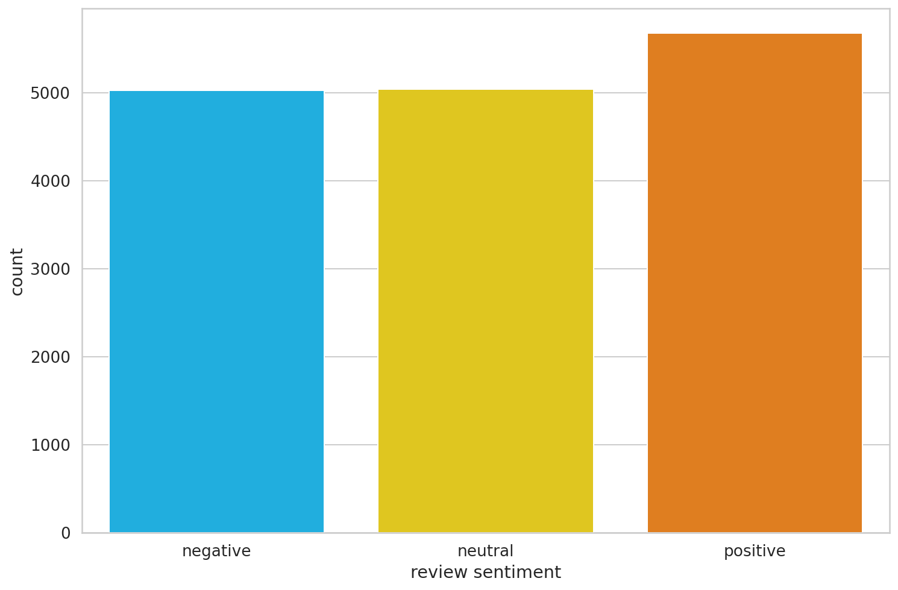
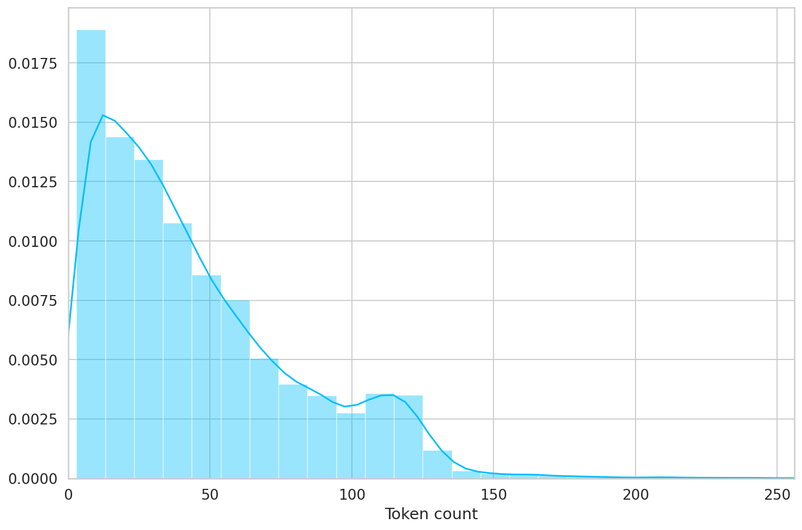
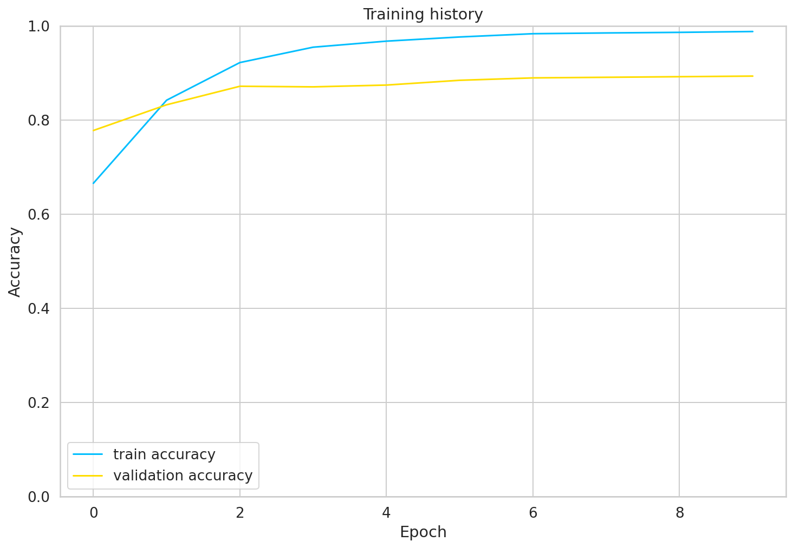
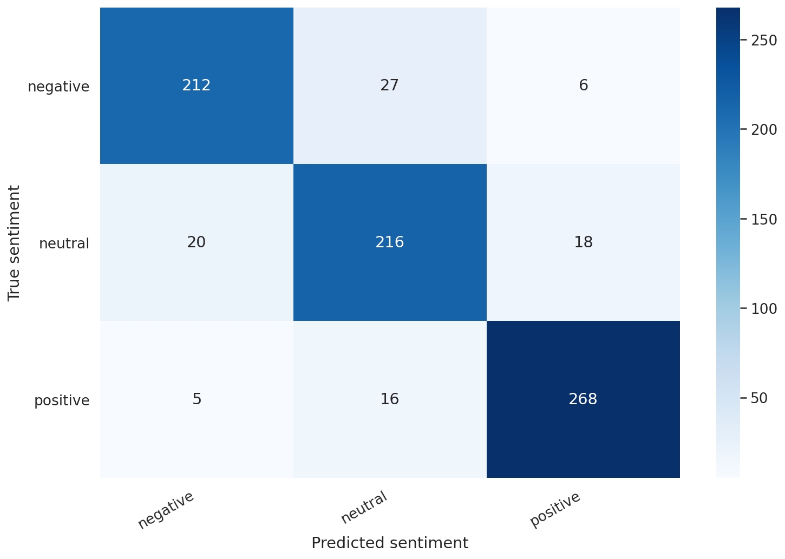
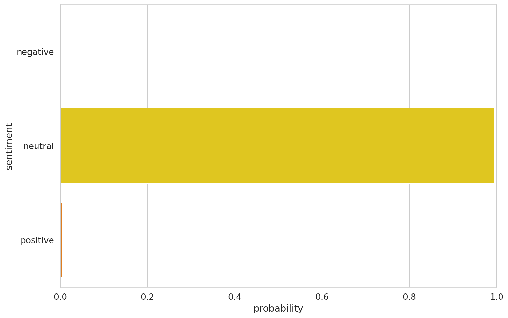

# Sentiment Analysis with BERT and Transformers by Hugging Face

> TL;DR In this tutorial, you'll learn how to fine-tune BERT for sentiment analysis. You'll do the required text preprocessing (special tokens, padding, and attention masks) and build a Sentiment Classifier using the amazing Transformers library by Hugging Face!

- [Run the notebook in your browser (Google Colab)](https://colab.research.google.com/drive/1PHv-IRLPCtv7oTcIGbsgZHqrB5LPvB7S)
- [Read the `Getting Things Done with Pytorch` book](https://github.com/curiousily/Getting-Things-Done-with-Pytorch)

You'll learn how to:

- Intuitively understand what BERT is
- Preprocess text data for BERT and build PyTorch Dataset (tokenization, attention masks, and padding)
- Use Transfer Learning to build Sentiment Classifier using the Transformers library by Hugging Face
- Evaluate the model on test data
- Predict sentiment on raw text

Let's get started!

## What is BERT?

BERT (introduced in [this paper](https://arxiv.org/abs/1810.04805)) stands for Bidirectional Encoder Representations from Transformers. If you don't know what most of that means - you've come to the right place! Let's unpack the main ideas:

- Bidirectional - to understand the text you're looking you'll have to look back (at the previous words) and forward (at the next words)
- Transformers - The [Attention Is All You Need](https://arxiv.org/abs/1706.03762) paper presented the Transformer model. The Transformer reads entire sequences of tokens at once. In a sense, the model is non-directional, while LSTMs read sequentially (left-to-right or right-to-left). The attention mechanism allows for learning contextual relations between words (e.g. `his` in a sentence refers to Jim).
- (Pre-trained) contextualized word embeddings - [The ELMO paper](https://arxiv.org/abs/1802.05365v2) introduced a way to encode words based on their meaning/context. Nails has multiple meanings - fingernails and metal nails.

BERT was trained by masking 15% of the tokens with the goal to guess them. An additional objective was to predict the next sentence. Let's look at examples of these tasks:

### Masked Language Modeling (Masked LM)

The objective of this task is to guess the masked tokens. Let's look at an example, and try to not make it harder than it has to be:

That's `[mask]` she `[mask]` -> That's what she said

### Next Sentence Prediction (NSP)

Given a pair of two sentences, the task is to say whether or not the second follows the first (binary classification). Let's continue with the example:

_Input_ = `[CLS]` That's `[mask]` she `[mask]`. [SEP] Hahaha, nice! [SEP]

_Label_ = _IsNext_

_Input_ = `[CLS]` That's `[mask]` she `[mask]`. [SEP] Dwight, you ignorant `[mask]`! [SEP]

_Label_ = _NotNext_

The training corpus was comprised of two entries: [Toronto Book Corpus](https://arxiv.org/abs/1506.06724) (800M words) and English Wikipedia (2,500M words). While the original Transformer has an encoder (for reading the input) and a decoder (that makes the prediction), BERT uses only the decoder.

BERT is simply a pre-trained stack of Transformer Encoders. How many Encoders? We have two versions - with 12 (BERT base) and 24 (BERT Large).

### Is This Thing Useful in Practice?

The BERT paper was released along with [the source code](https://github.com/google-research/bert) and pre-trained models.

The best part is that you can do Transfer Learning (thanks to the ideas from OpenAI Transformer) with BERT for many NLP tasks - Classification, Question Answering, Entity Recognition, etc. You can train with small amounts of data and achieve great performance!

## Setup

We'll need [the Transformers library](https://huggingface.co/transformers/) by Hugging Face:

```sh
!pip install -qq transformers
```

```py
%reload_ext watermark
%watermark -v -p numpy,pandas,torch,transformers
```

    CPython 3.6.9
    IPython 5.5.0

    numpy 1.18.2
    pandas 1.0.3
    torch 1.4.0
    transformers 2.8.0

```py
import transformers
from transformers import BertModel, BertTokenizer, AdamW, get_linear_schedule_with_warmup
import torch

import numpy as np
import pandas as pd
import seaborn as sns
from pylab import rcParams
import matplotlib.pyplot as plt
from matplotlib import rc
from sklearn.model_selection import train_test_split
from sklearn.metrics import confusion_matrix, classification_report
from collections import defaultdict
from textwrap import wrap

from torch import nn, optim
from torch.utils.data import Dataset, DataLoader

%matplotlib inline
%config InlineBackend.figure_format='retina'

sns.set(style='whitegrid', palette='muted', font_scale=1.2)

HAPPY_COLORS_PALETTE = ["#01BEFE", "#FFDD00", "#FF7D00", "#FF006D", "#ADFF02", "#8F00FF"]

sns.set_palette(sns.color_palette(HAPPY_COLORS_PALETTE))

rcParams['figure.figsize'] = 12, 8

RANDOM_SEED = 42
np.random.seed(RANDOM_SEED)
torch.manual_seed(RANDOM_SEED)
device = torch.device("cuda:0" if torch.cuda.is_available() else "cpu")
```

## Data Exploration

We'll load the Google Play app reviews dataset, that we've put together in the previous part:

```sh
!gdown --id 1S6qMioqPJjyBLpLVz4gmRTnJHnjitnuV
!gdown --id 1zdmewp7ayS4js4VtrJEHzAheSW-5NBZv
```

```py
df = pd.read_csv("reviews.csv")
df.shape
```

    (15746, 11)

We have about 16k examples. Let's check for missing values:

```py
df.info()
```

    <class 'pandas.core.frame.DataFrame'>
    RangeIndex: 15746 entries, 0 to 15745
    Data columns (total 11 columns):
     #   Column                Non-Null Count  Dtype
    ---  ------                --------------  -----
     0   userName              15746 non-null  object
     1   userImage             15746 non-null  object
     2   content               15746 non-null  object
     3   score                 15746 non-null  int64
     4   thumbsUpCount         15746 non-null  int64
     5   reviewCreatedVersion  13533 non-null  object
     6   at                    15746 non-null  object
     7   replyContent          7367 non-null   object
     8   repliedAt             7367 non-null   object
     9   sortOrder             15746 non-null  object
     10  appId                 15746 non-null  object
    dtypes: int64(2), object(9)
    memory usage: 1.3+ MB

Great, no missing values in the score and review texts! Do we have class imbalance?

```py
sns.countplot(df.score)
plt.xlabel('review score');
```


That's hugely imbalanced, but it's okay. We're going to convert the dataset into negative, neutral and positive sentiment:

```py
def to_sentiment(rating):
  rating = int(rating)
  if rating <= 2:
    return 0
  elif rating == 3:
    return 1
  else:
    return 2

df['sentiment'] = df.score.apply(to_sentiment)
```

```py
class_names = ['negative', 'neutral', 'positive']
```

```py
ax = sns.countplot(df.sentiment)
plt.xlabel('review sentiment')
ax.set_xticklabels(class_names);
```



The balance was (mostly) restored.

## Data Preprocessing

You might already know that Machine Learning models don't work with raw text. You need to convert text to numbers (of some sort). BERT requires even more attention (good one, right?). Here are the requirements:

- Add special tokens to separate sentences and do classification
- Pass sequences of constant length (introduce padding)
- Create array of 0s (pad token) and 1s (real token) called _attention mask_

The Transformers library provides (you've guessed it) a wide variety of Transformer models (including BERT). It works with TensorFlow and PyTorch! It also includes prebuild tokenizers that do the heavy lifting for us!

```py
PRE_TRAINED_MODEL_NAME = 'bert-base-cased'
```

> You can use a cased and uncased version of BERT and tokenizer. I've experimented with both. The cased version works better. Intuitively, that makes sense, since "BAD" might convey more sentiment than "bad".

Let's load a pre-trained [BertTokenizer](https://huggingface.co/transformers/model_doc/bert.html#berttokenizer):

```py
tokenizer = BertTokenizer.from_pretrained(PRE_TRAINED_MODEL_NAME)
```

We'll use this text to understand the tokenization process:

```py
sample_txt = 'When was I last outside? I am stuck at home for 2 weeks.'
```

Some basic operations can convert the text to tokens and tokens to unique integers (ids):

```py
tokens = tokenizer.tokenize(sample_txt)
token_ids = tokenizer.convert_tokens_to_ids(tokens)

print(f' Sentence: {sample_txt}')
print(f'   Tokens: {tokens}')
print(f'Token IDs: {token_ids}')
```

     Sentence: When was I last outside? I am stuck at home for 2 weeks.
       Tokens: ['When', 'was', 'I', 'last', 'outside', '?', 'I', 'am', 'stuck', 'at', 'home', 'for', '2', 'weeks', '.']
    Token IDs: [1332, 1108, 146, 1314, 1796, 136, 146, 1821, 5342, 1120, 1313, 1111, 123, 2277, 119]

### Special Tokens

`[SEP]` - marker for ending of a sentence

```py
tokenizer.sep_token, tokenizer.sep_token_id
```

    ('[SEP]', 102)

`[CLS]` - we must add this token to the start of each sentence, so BERT knows we're doing classification

```py
tokenizer.cls_token, tokenizer.cls_token_id
```

    ('[CLS]', 101)

There is also a special token for padding:

```py
tokenizer.pad_token, tokenizer.pad_token_id
```

    ('[PAD]', 0)

BERT understands tokens that were in the training set. Everything else can be encoded using the `[UNK]` (unknown) token:

```py
tokenizer.unk_token, tokenizer.unk_token_id
```

    ('[UNK]', 100)

All of that work can be done using the [`encode_plus()`](https://huggingface.co/transformers/main_classes/tokenizer.html#transformers.PreTrainedTokenizer.encode_plus) method:

```py
encoding = tokenizer.encode_plus(
  sample_txt,
  max_length=32,
  add_special_tokens=True, # Add '[CLS]' and '[SEP]'
  return_token_type_ids=False,
  pad_to_max_length=True,
  return_attention_mask=True,
  return_tensors='pt',  # Return PyTorch tensors
)

encoding.keys()
```

    dict_keys(['input_ids', 'attention_mask'])

The token ids are now stored in a Tensor and padded to a length of 32:

```py
print(len(encoding['input_ids'][0]))
encoding['input_ids'][0]
```

    32
    tensor([ 101, 1332, 1108,  146, 1314, 1796,  136,  146, 1821, 5342, 1120, 1313,
            1111,  123, 2277,  119,  102,    0,    0,    0,    0,    0,    0,    0,
               0,    0,    0,    0,    0,    0,    0,    0])

The attention mask has the same length:

```py
print(len(encoding['attention_mask'][0]))
encoding['attention_mask']
```

    32
    tensor([[1, 1, 1, 1, 1, 1, 1, 1, 1, 1, 1, 1, 1, 1, 1, 1, 1, 0, 0, 0, 0, 0, 0, 0,
             0, 0, 0, 0, 0, 0, 0, 0]])

We can inverse the tokenization to have a look at the special tokens:

```py
tokenizer.convert_ids_to_tokens(encoding['input_ids'][0])
```

    ['[CLS]',
     'When',
     'was',
     'I',
     'last',
     'outside',
     '?',
     'I',
     'am',
     'stuck',
     'at',
     'home',
     'for',
     '2',
     'weeks',
     '.',
     '[SEP]',
     '[PAD]',
     '[PAD]',
     '[PAD]',
     '[PAD]',
     '[PAD]',
     '[PAD]',
     '[PAD]',
     '[PAD]',
     '[PAD]',
     '[PAD]',
     '[PAD]',
     '[PAD]',
     '[PAD]',
     '[PAD]',
     '[PAD]']

### Choosing Sequence Length

BERT works with fixed-length sequences. We'll use a simple strategy to choose the max length. Let's store the token length of each review:

```py
token_lens = []

for txt in df.content:
  tokens = tokenizer.encode(txt, max_length=512)
  token_lens.append(len(tokens))
```

and plot the distribution:

```py
sns.distplot(token_lens)
plt.xlim([0, 256]);
plt.xlabel('Token count');
```



Most of the reviews seem to contain less than 128 tokens, but we'll be on the safe side and choose a maximum length of 160.

```py
MAX_LEN = 160
```

We have all building blocks required to create a PyTorch dataset. Let's do it:

```py
class GPReviewDataset(Dataset):

  def __init__(self, reviews, targets, tokenizer, max_len):
    self.reviews = reviews
    self.targets = targets
    self.tokenizer = tokenizer
    self.max_len = max_len

  def __len__(self):
    return len(self.reviews)

  def __getitem__(self, item):
    review = str(self.reviews[item])
    target = self.targets[item]

    encoding = self.tokenizer.encode_plus(
      review,
      add_special_tokens=True,
      max_length=self.max_len,
      return_token_type_ids=False,
      pad_to_max_length=True,
      return_attention_mask=True,
      return_tensors='pt',
    )

    return {
      'review_text': review,
      'input_ids': encoding['input_ids'].flatten(),
      'attention_mask': encoding['attention_mask'].flatten(),
      'targets': torch.tensor(target, dtype=torch.long)
    }
```

The tokenizer is doing most of the heavy lifting for us. We also return the review texts, so it'll be easier to evaluate the predictions from our model. Let's split the data:

```py
df_train, df_test = train_test_split(
  df,
  test_size=0.1,
  random_state=RANDOM_SEED
)
df_val, df_test = train_test_split(
  df_test,
  test_size=0.5,
  random_state=RANDOM_SEED
)
```

```py
df_train.shape, df_val.shape, df_test.shape
```

    ((14171, 12), (787, 12), (788, 12))

We also need to create a couple of data loaders. Here's a helper function to do it:

```py
def create_data_loader(df, tokenizer, max_len, batch_size):
  ds = GPReviewDataset(
    reviews=df.content.to_numpy(),
    targets=df.sentiment.to_numpy(),
    tokenizer=tokenizer,
    max_len=max_len
  )

  return DataLoader(
    ds,
    batch_size=batch_size,
    num_workers=4
  )
```

```py
BATCH_SIZE = 16

train_data_loader = create_data_loader(df_train, tokenizer, MAX_LEN, BATCH_SIZE)
val_data_loader = create_data_loader(df_val, tokenizer, MAX_LEN, BATCH_SIZE)
test_data_loader = create_data_loader(df_test, tokenizer, MAX_LEN, BATCH_SIZE)
```

Let's have a look at an example batch from our training data loader:

```py
data = next(iter(train_data_loader))
data.keys()
```

    dict_keys(['review_text', 'input_ids', 'attention_mask', 'targets'])

```py
print(data['input_ids'].shape)
print(data['attention_mask'].shape)
print(data['targets'].shape)
```

    torch.Size([16, 160])
    torch.Size([16, 160])
    torch.Size([16])

## Sentiment Classification with BERT and Hugging Face

There are a lot of helpers that make using BERT easy with the Transformers library. Depending on the task you might want to use [BertForSequenceClassification](https://huggingface.co/transformers/model_doc/bert.html#bertforsequenceclassification), [BertForQuestionAnswering](https://huggingface.co/transformers/model_doc/bert.html#bertforquestionanswering) or something else.

But who cares, right? We're _hardcore_! We'll use the basic [BertModel](https://huggingface.co/transformers/model_doc/bert.html#bertmodel) and build our sentiment classifier on top of it. Let's load the model:

```py
bert_model = BertModel.from_pretrained(PRE_TRAINED_MODEL_NAME)
```

And try to use it on the encoding of our sample text:

```py
last_hidden_state, pooled_output = bert_model(
  input_ids=encoding['input_ids'],
  attention_mask=encoding['attention_mask']
)
```

The `last_hidden_state` is a sequence of hidden states of the last layer of the model. Obtaining the `pooled_output` is done by applying the [BertPooler](https://github.com/huggingface/transformers/blob/edf0582c0be87b60f94f41c659ea779876efc7be/src/transformers/modeling_bert.py#L426) on `last_hidden_state`:

```py
last_hidden_state.shape
```

    torch.Size([1, 32, 768])

We have the hidden state for each of our 32 tokens (the length of our example sequence). But why 768? This is the number of hidden units in the feedforward-networks. We can verify that by checking the config:

```py
bert_model.config.hidden_size
```

    768

You can think of the `pooled_output` as a summary of the content, according to BERT. Albeit, you might try and do better. Let's look at the shape of the output:

```py
pooled_output.shape
```

    torch.Size([1, 768])

We can use all of this knowledge to create a classifier that uses the BERT model:

```py
class SentimentClassifier(nn.Module):

  def __init__(self, n_classes):
    super(SentimentClassifier, self).__init__()
    self.bert = BertModel.from_pretrained(PRE_TRAINED_MODEL_NAME)
    self.drop = nn.Dropout(p=0.3)
    self.out = nn.Linear(self.bert.config.hidden_size, n_classes)

  def forward(self, input_ids, attention_mask):
    _, pooled_output = self.bert(
      input_ids=input_ids,
      attention_mask=attention_mask
    )
    output = self.drop(pooled_output)
    return self.out(output
```

Our classifier delegates most of the heavy lifting to the BertModel. We use a dropout layer for some regularization and a fully-connected layer for our output. Note that we're returning the raw output of the last layer since that is required for the cross-entropy loss function in PyTorch to work.

This should work like any other PyTorch model. Let's create an instance and move it to the GPU

```py
model = SentimentClassifier(len(class_names))
model = model.to(device)
```

We'll move the example batch of our training data to the GPU:

```py
input_ids = data['input_ids'].to(device)
attention_mask = data['attention_mask'].to(device)

print(input_ids.shape) # batch size x seq length
print(attention_mask.shape) # batch size x seq length
```

    torch.Size([16, 160])
    torch.Size([16, 160])

To get the predicted probabilities from our trained model, we'll apply the softmax function to the outputs:

```py
F.softmax(model(input_ids, attention_mask), dim=1)
```

    tensor([[0.5879, 0.0842, 0.3279],
            [0.4308, 0.1888, 0.3804],
            [0.4871, 0.1766, 0.3363],
            [0.3364, 0.0778, 0.5858],
            [0.4025, 0.1040, 0.4935],
            [0.3599, 0.1026, 0.5374],
            [0.5054, 0.1552, 0.3394],
            [0.5962, 0.1464, 0.2574],
            [0.3274, 0.1967, 0.4759],
            [0.3026, 0.1118, 0.5856],
            [0.4103, 0.1571, 0.4326],
            [0.4879, 0.2121, 0.3000],
            [0.3811, 0.1477, 0.4712],
            [0.3354, 0.1354, 0.5292],
            [0.3999, 0.2822, 0.3179],
            [0.5075, 0.1684, 0.3242]], device='cuda:0', grad_fn=<SoftmaxBackward>)

### Training

To reproduce the training procedure from the BERT paper, we'll use the [AdamW](https://huggingface.co/transformers/main_classes/optimizer_schedules.html#adamw) optimizer provided by Hugging Face. It corrects weight decay, so it's similar to the original paper. We'll also use a linear scheduler with no warmup steps:

```py
EPOCHS = 10

optimizer = AdamW(model.parameters(), lr=2e-5, correct_bias=False)
total_steps = len(train_data_loader) * EPOCHS

scheduler = get_linear_schedule_with_warmup(
  optimizer,
  num_warmup_steps=0,
  num_training_steps=total_steps
)

loss_fn = nn.CrossEntropyLoss().to(device)
```

How do we come up with all hyperparameters? The BERT authors have some recommendations for fine-tuning:

- Batch size: 16, 32
- Learning rate (Adam): 5e-5, 3e-5, 2e-5
- Number of epochs: 2, 3, 4

We're going to ignore the number of epochs recommendation but stick with the rest. Note that increasing the batch size reduces the training time significantly, but gives you lower accuracy.

Let's continue with writing a helper function for training our model for one epoch:

```py
def train_epoch(
  model,
  data_loader,
  loss_fn,
  optimizer,
  device,
  scheduler,
  n_examples
):
  model = model.train()

  losses = []
  correct_predictions = 0

  for d in data_loader:
    input_ids = d["input_ids"].to(device)
    attention_mask = d["attention_mask"].to(device)
    targets = d["targets"].to(device)

    outputs = model(
      input_ids=input_ids,
      attention_mask=attention_mask
    )

    _, preds = torch.max(outputs, dim=1)
    loss = loss_fn(outputs, targets)

    correct_predictions += torch.sum(preds == targets)
    losses.append(loss.item())

    loss.backward()
    nn.utils.clip_grad_norm_(model.parameters(), max_norm=1.0)
    optimizer.step()
    scheduler.step()
    optimizer.zero_grad()

  return correct_predictions.double() / n_examples, np.mean(losses)
```

Training the model should look familiar, except for two things. The scheduler gets called every time a batch is fed to the model. We're avoiding exploding gradients by clipping the gradients of the model using [clip*grad_norm*](https://pytorch.org/docs/stable/nn.html#clip-grad-norm).

Let's write another one that helps us evaluate the model on a given data loader:

```py
def eval_model(model, data_loader, loss_fn, device, n_examples):
  model = model.eval()

  losses = []
  correct_predictions = 0

  with torch.no_grad():
    for d in data_loader:
      input_ids = d["input_ids"].to(device)
      attention_mask = d["attention_mask"].to(device)
      targets = d["targets"].to(device)

      outputs = model(
        input_ids=input_ids,
        attention_mask=attention_mask
      )
      _, preds = torch.max(outputs, dim=1)

      loss = loss_fn(outputs, targets)

      correct_predictions += torch.sum(preds == targets)
      losses.append(loss.item())

  return correct_predictions.double() / n_examples, np.mean(losses)
```

Using those two, we can write our training loop. We'll also store the training history:

```py
%%time

history = defaultdict(list)
best_accuracy = 0

for epoch in range(EPOCHS):

  print(f'Epoch {epoch + 1}/{EPOCHS}')
  print('-' * 10)

  train_acc, train_loss = train_epoch(
    model,
    train_data_loader,
    loss_fn,
    optimizer,
    device,
    scheduler,
    len(df_train)
  )

  print(f'Train loss {train_loss} accuracy {train_acc}')

  val_acc, val_loss = eval_model(
    model,
    val_data_loader,
    loss_fn,
    device,
    len(df_val)
  )

  print(f'Val   loss {val_loss} accuracy {val_acc}')
  print()

  history['train_acc'].append(train_acc)
  history['train_loss'].append(train_loss)
  history['val_acc'].append(val_acc)
  history['val_loss'].append(val_loss)

  if val_acc > best_accuracy:
    torch.save(model.state_dict(), 'best_model_state.bin')
    best_accuracy = val_acc
```

    Epoch 1/10
    ----------
    Train loss 0.7330631300571541 accuracy 0.6653729447463129
    Val   loss 0.5767546480894089 accuracy 0.7776365946632783

    Epoch 2/10
    ----------
    Train loss 0.4158683338330777 accuracy 0.8420012701997036
    Val   loss 0.5365073362737894 accuracy 0.832274459974587

    Epoch 3/10
    ----------
    Train loss 0.24015077009679367 accuracy 0.922023851527768
    Val   loss 0.5074492372572422 accuracy 0.8716645489199493

    Epoch 4/10
    ----------
    Train loss 0.16012676668187295 accuracy 0.9546962105708843
    Val   loss 0.6009970247745514 accuracy 0.8703939008894537

    Epoch 5/10
    ----------
    Train loss 0.11209654617575301 accuracy 0.9675393409074872
    Val   loss 0.7367783848941326 accuracy 0.8742058449809403

    Epoch 6/10
    ----------
    Train loss 0.08572274737026433 accuracy 0.9764307388328276
    Val   loss 0.7251267762482166 accuracy 0.8843710292249047

    Epoch 7/10
    ----------
    Train loss 0.06132202987342602 accuracy 0.9833462705525369
    Val   loss 0.7083295831084251 accuracy 0.889453621346887

    Epoch 8/10
    ----------
    Train loss 0.050604159273123096 accuracy 0.9849693035071626
    Val   loss 0.753860274553299 accuracy 0.8907242693773825

    Epoch 9/10
    ----------
    Train loss 0.04373276197092931 accuracy 0.9862395032107826
    Val   loss 0.7506809896230697 accuracy 0.8919949174078781

    Epoch 10/10
    ----------
    Train loss 0.03768671146314381 accuracy 0.9880036694658105
    Val   loss 0.7431786182522774 accuracy 0.8932655654383737

    CPU times: user 29min 54s, sys: 13min 28s, total: 43min 23s
    Wall time: 43min 43s

Note that we're storing the state of the best model, indicated by the highest validation accuracy.

Whoo, this took some time! We can look at the training vs validation accuracy:

```py
plt.plot(history['train_acc'], label='train accuracy')
plt.plot(history['val_acc'], label='validation accuracy')

plt.title('Training history')
plt.ylabel('Accuracy')
plt.xlabel('Epoch')
plt.legend()
plt.ylim([0, 1]);
```



The training accuracy starts to approach 100% after 10 epochs or so. You might try to fine-tune the parameters a bit more, but this will be good enough for us.

Don't want to wait? Uncomment the next cell to download my pre-trained model:

```py
# !gdown --id 1V8itWtowCYnb2Bc9KlK9SxGff9WwmogA

# model = SentimentClassifier(len(class_names))
# model.load_state_dict(torch.load('best_model_state.bin'))
# model = model.to(device)
```

## Evaluation

So how good is our model on predicting sentiment? Let's start by calculating the accuracy on the test data:

```py
test_acc, _ = eval_model(
  model,
  test_data_loader,
  loss_fn,
  device,
  len(df_test)
)

test_acc.item()
```

    0.883248730964467

The accuracy is about 1% lower on the test set. Our model seems to generalize well.

We'll define a helper function to get the predictions from our model:

```py
def get_predictions(model, data_loader):
  model = model.eval()

  review_texts = []
  predictions = []
  prediction_probs = []
  real_values = []

  with torch.no_grad():
    for d in data_loader:

      texts = d["review_text"]
      input_ids = d["input_ids"].to(device)
      attention_mask = d["attention_mask"].to(device)
      targets = d["targets"].to(device)

      outputs = model(
        input_ids=input_ids,
        attention_mask=attention_mask
      )
      _, preds = torch.max(outputs, dim=1)

      review_texts.extend(texts)
      predictions.extend(preds)
      prediction_probs.extend(outputs)
      real_values.extend(targets)

  predictions = torch.stack(predictions).cpu()
  prediction_probs = torch.stack(prediction_probs).cpu()
  real_values = torch.stack(real_values).cpu()
  return review_texts, predictions, prediction_probs, real_values
```

This is similar to the evaluation function, except that we're storing the text of the reviews and the predicted probabilities:

```py
y_review_texts, y_pred, y_pred_probs, y_test = get_predictions(
  model,
  test_data_loader
)
```

Let's have a look at the classification report

```py
print(classification_report(y_test, y_pred, target_names=class_names))
```

                  precision    recall  f1-score   support

        negative       0.89      0.87      0.88       245
         neutral       0.83      0.85      0.84       254
        positive       0.92      0.93      0.92       289

        accuracy                           0.88       788
       macro avg       0.88      0.88      0.88       788
    weighted avg       0.88      0.88      0.88       788

Looks like it is really hard to classify neutral (3 stars) reviews. And I can tell you from experience, looking at many reviews, those are hard to classify.

We'll continue with the confusion matrix:

```py
def show_confusion_matrix(confusion_matrix):
  hmap = sns.heatmap(confusion_matrix, annot=True, fmt="d", cmap="Blues")
  hmap.yaxis.set_ticklabels(hmap.yaxis.get_ticklabels(), rotation=0, ha='right')
  hmap.xaxis.set_ticklabels(hmap.xaxis.get_ticklabels(), rotation=30, ha='right')
  plt.ylabel('True sentiment')
  plt.xlabel('Predicted sentiment');

cm = confusion_matrix(y_test, y_pred)
df_cm = pd.DataFrame(cm, index=class_names, columns=class_names)
show_confusion_matrix(df_cm)
```



This confirms that our model is having difficulty classifying neutral reviews. It mistakes those for negative and positive at a roughly equal frequency.

That's a good overview of the performance of our model. But let's have a look at an example from our test data:

```py
idx = 2

review_text = y_review_texts[idx]
true_sentiment = y_test[idx]
pred_df = pd.DataFrame({
  'class_names': class_names,
  'values': y_pred_probs[idx]
})
```

```py
print("\n".join(wrap(review_text)))
print()
print(f'True sentiment: {class_names[true_sentiment]}')
```

    I used to use Habitica, and I must say this is a great step up. I'd
    like to see more social features, such as sharing tasks - only one
    person has to perform said task for it to be checked off, but only
    giving that person the experience and gold. Otherwise, the price for
    subscription is too steep, thus resulting in a sub-perfect score. I
    could easily justify $0.99/month or eternal subscription for $15. If
    that price could be met, as well as fine tuning, this would be easily
    worth 5 stars.

    True sentiment: neutral

Now we can look at the confidence of each sentiment of our model:

```py
sns.barplot(x='values', y='class_names', data=pred_df, orient='h')
plt.ylabel('sentiment')
plt.xlabel('probability')
plt.xlim([0, 1]);
```



### Predicting on Raw Text

Let's use our model to predict the sentiment of some raw text:

```py
review_text = "I love completing my todos! Best app ever!!!"
```

We have to use the tokenizer to encode the text:

```py
encoded_review = tokenizer.encode_plus(
  review_text,
  max_length=MAX_LEN,
  add_special_tokens=True,
  return_token_type_ids=False,
  pad_to_max_length=True,
  return_attention_mask=True,
  return_tensors='pt',
)
```

Let's get the predictions from our model:

```py
input_ids = encoded_review['input_ids'].to(device)
attention_mask = encoded_review['attention_mask'].to(device)

output = model(input_ids, attention_mask)
_, prediction = torch.max(output, dim=1)

print(f'Review text: {review_text}')
print(f'Sentiment  : {class_names[prediction]}')
```

    Review text: I love completing my todos! Best app ever!!!
    Sentiment  : positive

## Summary

Nice job! You learned how to use BERT for sentiment analysis. You built a custom classifier using the Hugging Face library and trained it on our app reviews dataset!

- [Run the notebook in your browser (Google Colab)](https://colab.research.google.com/drive/1PHv-IRLPCtv7oTcIGbsgZHqrB5LPvB7S)
- [Read the `Getting Things Done with Pytorch` book](https://github.com/curiousily/Getting-Things-Done-with-Pytorch)

You learned how to:

- Intuitively understand what BERT is
- Preprocess text data for BERT and build PyTorch Dataset (tokenization, attention masks, and padding)
- Use Transfer Learning to build Sentiment Classifier using the Transformers library by Hugging Face
- Evaluate the model on test data
- Predict sentiment on raw text

Next, we'll learn how to deploy our trained model behind a REST API and build a simple web app to access it.

## References

- [BERT: Pre-training of Deep Bidirectional Transformers for Language Understanding](https://arxiv.org/abs/1810.04805)
- [L11 Language Models - Alec Radford (OpenAI)](https://www.youtube.com/watch?v=BnpB3GrpsfM)
- [The Illustrated BERT, ELMo, and co.](https://jalammar.github.io/illustrated-bert/)
- [BERT Fine-Tuning Tutorial with PyTorch](https://mccormickml.com/2019/07/22/BERT-fine-tuning/)
- [How to Fine-Tune BERT for Text Classification?](https://arxiv.org/pdf/1905.05583.pdf)
- [Huggingface Transformers](https://huggingface.co/transformers/)
- [BERT Explained: State of the art language model for NLP](https://towardsdatascience.com/bert-explained-state-of-the-art-language-model-for-nlp-f8b21a9b6270)
